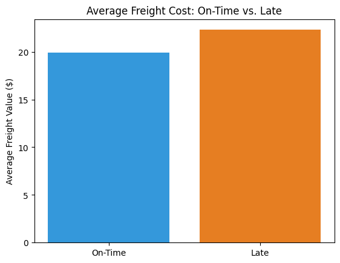
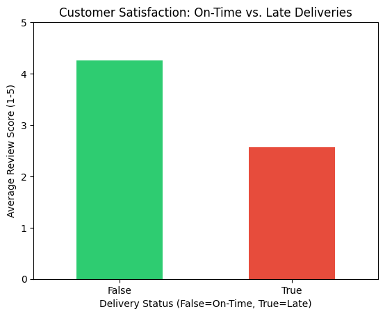
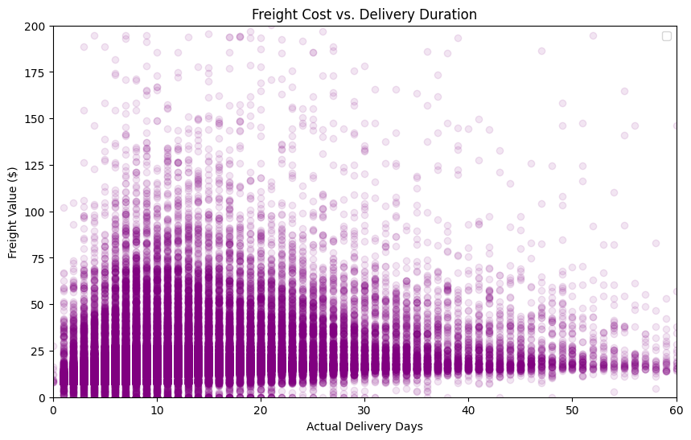

# 📦 Logistics Performance Analysis  
### E-Commerce Delivery Reliability, Cost Efficiency, and Customer Satisfaction (2016–2018)

This project analyzes **100,000+ e-commerce orders** from the **Olist Brazilian e-commerce dataset** to evaluate how delivery performance impacts **customer satisfaction and freight costs**.

The focus is not just descriptive analytics, but **identifying operational failure points**, quantifying their **business impact**, and surfacing **actionable logistics insights** relevant to operations and supply chain decision-making.

---

## 🔍 Business Problem

E-commerce logistics teams often assume that:
- Higher freight spend leads to faster delivery
- Delays are isolated operational issues
- Customer dissatisfaction is loosely related to fulfillment speed

This analysis tests those assumptions using real-world delivery data to answer:

- Where do delivery delays actually occur?
- How costly are late deliveries to the business?
- How strongly do delays affect customer satisfaction?
- Does higher freight cost translate to better delivery performance?

---

## 🧠 Analytical Scope

This analysis evaluates:

✔ **Delivery reliability** by measuring late vs on-time order fulfillment  
✔ **Geographic friction points** across customer regions  
✔ **Customer sentiment impact** through review score behavior  
✔ **Freight cost inefficiency** associated with delayed deliveries  
✔ **Cost vs speed trade-offs** in logistics operations  

---

## 🗄️ Data Modeling & SQL Integration

Multiple Olist datasets were **joined using SQL** to create a single analysis-ready table with delivery, customer, and review information.

### Joined Datasets
- `olist_orders_dataset`
- `olist_order_items_dataset`
- `olist_customers_dataset`
- `olist_order_reviews_dataset`

### SQL Approach
- INNER JOINs on `order_id` and `customer_id`
- Delivery timestamps preserved for delay calculations
- Cleaned, relational output exported for Python analysis

This ensured analytical accuracy before any metric computation.

---

## ⚙️ Tools & Technologies

- **SQL** – relational joins and data modeling  
- **Python**
- **Pandas** – data cleaning, aggregation, feature derivation  
- **Matplotlib** – business-focused visualizations  
- **Jupyter Notebook** – exploratory and analytical workflow  

---

## 🚀 How to Run the Analysis

### 1️⃣ Clone the Repository

```bash
git clone https://github.com/Fareed04/logistics-performance-analysis.git
cd logistics-performance-analysis
````

### 2️⃣ Install Dependencies

```bash
pip install -r requirements.txt
```

### 3️⃣ Launch the Notebook

```bash
jupyter notebook notebooks/experiments.ipynb
```

---

## 🚚 Freight Cost Comparison

### Late vs On-Time Deliveries



Late deliveries incur **higher average freight costs**, indicating that inefficiencies increase spend **without improving delivery outcomes**.

---

## 😊 Customer Satisfaction Impact of Delivery Delays



Delayed orders receive **significantly lower review scores**, demonstrating a direct link between delivery reliability and customer experience.

---

## 🔗 Freight Cost vs Delivery Speed



There is a **weak correlation** between freight cost and delivery duration, showing that **higher spend does not guarantee faster fulfillment**.

---

## 📌 Key Insights & Business Impact

* **Late deliveries create a double loss**
  Freight costs increase by **~12%**, while customer satisfaction drops sharply from **4.26 to 2.56**.

* **Operational bottlenecks are geographic**
  **São Paulo and Rio de Janeiro** account for the highest concentration of delivery delays.

* **Cost does not equal speed**
  A weak **0.21 correlation** confirms that spending more on shipping does not reliably improve delivery performance.

* **Clear optimization opportunity**
  Improving logistics efficiency can simultaneously **reduce costs** and **improve customer satisfaction**.

---

## 🙌 Reuse & Adaptation

This analysis can be adapted for:

* Other e-commerce platforms
* Third-party logistics providers
* Regional delivery performance audits

Feel free to fork and extend the project.

---

## 📬 Contact

**Fareed Ologundudu**
🔗 [LinkedIn](https://www.linkedin.com/in/fareed-ologundudu-129506249/)
💻 [GitHub](https://github.com/Fareed04)
